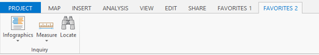

##Lab 1: Working with DAML 

#####In this lab you will learn how to
* Customize ArcGIS Pro using DAML
* Add new elements like Button, Tab, and Group declaratively using DAML
* Customize the ArcGIS Pro Ribbons (ie Tabs) using DAML

*******
* [Step 1: Create an ArcGIS Pro Add-In Module Project](#step-1-create-an-arcgis-pro-add-in-module-project)
* [Step 2: Customize the ArcGIS Pro Ribbon with a new Favorites Tab](#step-2-customize-the-arcgis-pro-ribbon-with-a-new-favorites-tab)
* [Step 3: Add ArcGIS Pro Commands to your Favorites Tab](#step-3-add-core-arcgis-pro-commands-to-your-favorites-tab)
* [Step 4: Modify the Core Map Tab](#step-4-modify-the-core-map-tab)

**Estimated completion time: 30 minutes**
****

####Step 1: Create an ArcGIS Pro Add-In Module Project
* Open Visual Studio and select New Project.  
* From the New Project dialog, expand the Templates\Visual C#\ArcGIS. Select the ArcGIS Pro Add-ins folder. 
* The ArcGIS Pro Module Add-in Visual Studio project item template will be displayed. Name your project ```working_with_DAML```. Click OK.  **Note: It is very important to call your add-in project ```working_with_DAML```.  None of the copy\paste instructions in this lab will work if you call your project something else.**  
  
Change the location or accept the default. Click OK.  
* Visual Studio will create a new Visual C# project for you. You will notice the following content in your new project:  


The Config.daml file will be opened (by default) in Visual Studio. The Module1.cs file contains your Add-in Module code. The code will be similar to this:

```c#
internal class Module1 : Module
{
    private static Module1 _this = null;

    /// <summary>
    /// Retrieve the singleton instance to this module here
    /// </summary>
    public static Module1 Current
    {
        get
        {
            return _this ?? (_this = (Module1)FrameworkApplication.FindModule("working_with_DAML_Module"));
        }
    }
    ....
```

Note that the module contains a private reference to your Module instance which is a singleton. The string "working_with_DAML_Module" is your module id. Framework uses this id to reference your module in the DAML and to find your associated module instance in the FindModule method of the FrameworkApplication module. By default, your module class will be called "Module1". The default namespace will be the name you entered in the New Project dialog, which, in this case, is working_with_DAML_Module. 

Note also in the Config.daml file that the id attribute of the insertModule tag matches the id within the Module1.cs file and the className attribute also matches the class name of the Module.

```xml

<modules>
    <insertModule id="working_with_DAML_Module" className="Module1" autoLoad="false" caption="Module1">
	...
</modules>
```

* Right click the project node in the Solution Explorer and select "Pro Generate DAML Ids" from the context menu.  Running the utility converts all of the ArcGIS Pro Desktop Application Markup Language (DAML) string IDs into static string properties organized by DAML element types (for example, Button, Dockpane, Tool, Condition, and so on). This allows you to use the IntelliSense feature of Visual Studio within your source code file to add IDs, rather than having to manually type DAML string IDs).

* Compile and Build the project. If you have errors in your output window check that you have the ArcGIS Pro application and the ArcGIS Pro SDK for .NET correctly installed. As long as you have not changed the syntax in any of the generated files (from the Project template) there should be no compilation errors.  

####Step 2: Customize the ArcGIS Pro Ribbon with a new Favorites tab.

In this step, we will be customizing ArcGIS Pro by creating two new groups and adding them to a new Favorites 1 Tab on the ArcGIS Pro ribbon.

* Locate the "group" element in your config.daml. Edit its Caption so that a "Lab group 1" group is created. Edit the "appearsOnAddInTab" attribute to be set to "false".  It should now look like this:

```xml
<groups>
    <!-- comment this out if you have no controls on the Addin tab to avoid
          an empty group-->
    <group id="working_with_DAML_Group1" caption="Lab group 1" appearsOnAddInTab="false">
      <!-- host controls within groups -->
    </group>
</groups>
``` 

* Add another new group called "working_with_DAML_Group2" with a caption attribute set to "Lab group 2".  Copy and paste the DAML below:

```xml
<group id="working_with_DAML_Group2" caption="Lab group 2" appearsOnAddInTab="false">
          <!-- host controls within groups -->
</group>
``` 

Your groups element should look like this:

```XML

<groups>
    <!-- comment this out if you have no controls on the Addin tab to avoid
          an empty group-->
    <group id="working_with_DAML_Group1" caption="Lab group 1" appearsOnAddInTab="false">
      <!-- host controls within groups -->
    </group>
   <group id="working_with_DAML_Group2" caption="Lab group 2" appearsOnAddInTab="false">
      <!-- host controls within groups -->
    </group>
</groups>  
```

* Reference the Lab 1 and Lab 2 groups you created in a new "Favorites 1" tab. In the config.daml in your project, locate the "tabs" element.  Un-Comment the tab element and edit the "caption" attribute to "Favorites 1". Add  group elements with a refID of "working_with_DAML_Group1" and "working_with_DAML_Group2" respectively.  The DAML should look like this now:  

```xml
<!-- uncomment to have the control hosted on a separate tab-->
<tabs>
  <tab id="working_with_DAML_Tab1" caption="Favorites 1">
    <group refID="working_with_DAML_Group1"/>
    <group refID="working_with_DAML_Group2"/>
  </tab>
</tabs>
```

#### Step 3: Add Core ArcGIS Pro Commands to your Favorites Tab

DAML elements can be inserted, updated, or deleted in any Config.daml. This includes "core" elements like commands, menus, and groups. One module may insert a single button into another extension’s ribbon group. To illustrate this, we will now add a few existing ArcGIS Pro Commands to the groups in our Add-in we created in Step 2. We will also reference the "Inquiry" Core group into a new custom "Favorites 2" tab.

* Locate the group element for "working_with_DAML_Group1" in your config.daml. We will now add the references to a few ArcGIS Pro core buttons to "working_with_DAML_Group1" and "working_with_DAML_Group2".  Copy and paste the code snippet below into the `groups` tag of your config.daml.

```xml
 <groups>
        <!-- comment this out if you have no controls on the Addin tab to avoid
              an empty group-->
        <group id="working_with_DAML_Group1" caption="Lab group 1" appearsOnAddInTab="false">
          <!-- host controls within groups -->
          <!--Core Pro Commands-->
          <toolPalette refID="esri_mapping_newMapPalette" />
          <button refID="esri_core_saveProjectButton" />
          <button refID="esri_core_saveProjectAsButton" />
          <gallery refID="esri_mapping_bookmarksNavigateGallery" />
          <button refID="esri_mapping_mapContextMenu_ExportMap" />          
        </group>
        <group id="working_with_DAML_Group2" caption="Lab group 2" appearsOnAddInTab="false">
          <!-- host controls within groups -->
          <!--Core Pro Commands-->
          <toolPalette refID="esri_mapping_selectToolPalette" />
          <button refID="esri_mapping_clearSelectionButton" />
          <button refID="esri_geoprocessing_selectByAttributeButton" />
          <button refID="esri_geoprocessing_selectByLocationButton" />
        </group>
      </groups>
```

* Create another Tab element called "Favorites 2" in your Config.daml. We will add a reference to the Core "Inquiry" group to this tab. Your DAML for the tab should look like this:  

```xml
<tab id="working_with_DAML_Tab2" caption="Favorites 2" >
  <group refID="esri_mapping_inquiryGroup" />
</tab>
```
* Compile and Run the Add-In. ArcGIS Pro will start. Log in with your Organization ID when prompted. Create a new project using the default "Map.aptx" template. After the project has opened, observe your new Favorites tabs containing the Lab groups with the Core commands, tools, etc you referenced.

<br>
  
  
<br>

* Stop debugging.

####Step 4: Modify the Core Map tab

Using the config.daml file, references can also be added to or removed from a **_core_** group using an "updateModule" and "updateGroup" element. In the updateModule element reference the module (or _extension_) you are modifying and on the updateGroup element reference the core group.

We will delete the core Bookmarks gallery from the Map tab's Navigate group. 

* In your config.daml file, paste the following xml code after the closing tag of the "insertModule" element

```xml
<updateModule refID="esri_mapping">
  <groups>
    <updateGroup refID="esri_mapping_navigateGroup">        
      <deleteButton refID="esri_mapping_bookmarksNavigateGallery"></deleteButton>         
    </updateGroup>
  </groups>
</updateModule>
```

* Compile and Run the Add-In to see the modified Map Tab.  

Before  | After
------------- | -------------
  | 
