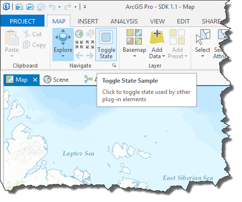
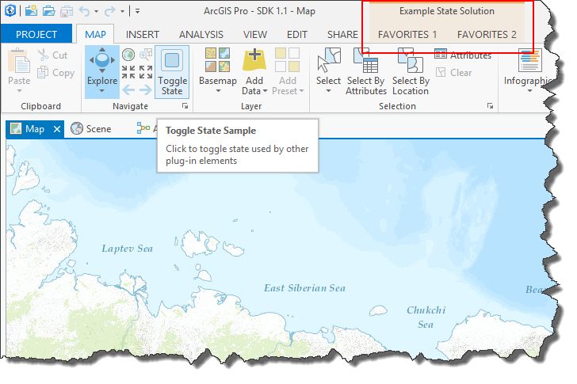

##WorkingWithDAML

<!-- TODO: Write a brief abstract explaining this sample -->
This sample shows how to:  
* Customize ArcGIS Pro using DAML  
* Add new elements like Button, Tab, and Group declaratively using DAML  
* Customize the ArcGIS Pro Ribbons (ie Tabs) using DAML  
* Use DAML conditions and states  
  


<a href="http://pro.arcgis.com/en/pro-app/sdk/" target="_blank">View it live</a>

<!-- TODO: Fill this section below with metadata about this sample-->
```
Language:      C#
Subject:       Framework
Contracts:     Button
Contributor:   ArcGIS Pro SDK
Organization:  Esri
Date:          7/8/2015
ArcGIS Pro:    ArcGIS Pro 1.1
Visual Studio: Visual Studio 12.0
```

##Resources

ArcGIS Pro SDK resources, including concepts, guides, tutorials, and snippets, will be available at ArcGIS Pro 1.1 in the [arcgis-pro-sdk repository](https://github.com/esri/arcgis-pro-sdk). The [arcgis-pro-sdk-community-samples repo](https://github.com/esri/arcgis-pro-sdk-community-samples) hosts ArcGIS Pro samples that provide some guidance on how to use the new .NET API to extend ArcGIS Pro. A complete [API Reference](http://pro.arcgis.com/en/pro-app/sdk/api-reference/) is also available online.

* [ProConcepts: ArcGIS Pro Add in Samples](https://github.com/Esri/arcgis-pro-sdk-community-samples/wiki/ProConcepts-ArcGIS-Pro-Add-in-Samples)
* [Sample data for community samples](https://github.com/Esri/arcgis-pro-sdk/releases/tag/1.1.0.3068_(Beta))
* [ArcGIS Pro API Reference Guide](http://pro.arcgis.com/en/pro-app/sdk/api-reference/index.html)
* [arcgis-pro-sdk-community-samples](https://github.com/Esri/arcgis-pro-sdk-community-samples)
* <a href="http://pro.arcgis.com/en/pro-app/sdk/" target="_blank">ArcGIS Pro SDK (pro.arcgis.com)</a>
* [FAQ](https://github.com/Esri/arcgis-pro-sdk/wiki/FAQ)  
* [ArcGIS Pro SDK Icons](https://github.com/Esri/arcgis-pro-sdk/releases/tag/1.1.0.3068_(Beta))  
  


##How to use the sample
<!-- TODO: Explain how this sample can be used. To use images in this section, create the image file in your sample project's screenshots folder. Use relative url to link to this image using this syntax:  -->
1. In Visual Studio click the Build menu. Then select Build Solution.  
1. Click Start button to open ArcGIS Pro.  
1. ArcGIS Pro will open.   
1. Open a map view and click on the Map tab a note the 'Toggle State' button on the Navigate group.    
  
1. Click on the 'Toggle State' button and view the new ribbon tabs become visible because their 'condition' (see DAML) changed.     
  
  


[](Esri Tags: ArcGIS-Pro-SDK)
[](Esri Language: C-Sharp)​


<p align = center>
<b> ArcGIS Pro 1.1 SDK for Microsoft .NET Framework</b>
</p>
&nbsp;&nbsp;&nbsp;&nbsp;&nbsp;&nbsp;&nbsp;&nbsp;&nbsp;&nbsp;&nbsp;&nbsp;&nbsp;&nbsp;&nbsp;&nbsp;&nbsp;&nbsp;&nbsp;&nbsp;[Home](https://github.com/Esri/arcgis-pro-sdk/wiki) | <a href="http://pro.arcgis.com/en/pro-app/sdk" target="_blank">ArcGIS Pro SDK</a> | <a href="http://pro.arcgis.com/en/pro-app/sdk/api-reference/index.html" target="_blank">API Reference</a> | [Requirements](#requirements) | [Download](#download) |  <a href="http://github.com/esri/arcgis-pro-sdk-community-samples" target="_blank">Samples</a>
