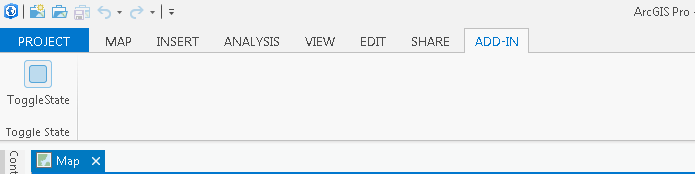
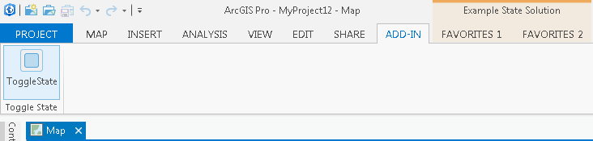

##Lab 2: Conditions and States 

The ArcGIS Pro framework incorporates a mechanism for triggering the activation of customizations based on user defined conditions. This is provided using the states and conditions DAML constructs. States and conditions provide a simple means for expressing when various GUI elements such as ribbon tabs, dock panes, buttons and tools should and shouldn’t be visible or enabled within the application. Read here for more about [Conditions and States](https://github.com/esri/arcgis-pro-sdk/wiki/proconcepts-framework#conditions-and-state). Refer to [ProGuide: Code Your Own States and Conditions](https://github.com/esri/arcgis-pro-sdk/wiki/ProGuide-Code-Your-Own-States-and-Conditions).


#####In this lab you will learn how to
* Use DAML conditions and states
* Implement a Delegate Command

You are going to be adding a new button to the Add-in Tab that toggles on or off a custom state that you will define in your Config.daml. That custom state will be associated with a custom condition (that you will also define in your DAML). The custom condition will be associated with the two tab groups you previously defined in **Lab 1**. When the state is activated it will flip the custom condition to **true** and the tab groups should become visible. When the state is deactivated the custom condition will be **false** and the tab groups will be hidden.

Note: It is suggested that you **_delete_** the Add-in from Lab1 to avoid confusion between the tabs and tab groups defined in _that_ Add-in and the duplicate tabs and tab groups copied to Lab 2. To delete the Add-in go to your `C:\Users\<your username>\Documents\ArcGIS\AddIns\ArcGISPro` and delete all its contents


*******
* [Step 1: Open the Lab2 Start Project](#step-1-open-the-lab2-start-project)
* [Step 2: Define a Custom Condition and State](#step-2-define-a-custom-condition-and-state)
* [Step 3: Add a New Button to the Config.daml](#step-3-add-a-new-button-to-the-configdaml)
* [Step 4: Implement the Delegate Command method](#step-4-implement-the-delegate-command-method)

**Estimated completion time: 20 minutes**
****


####Step 1: Open the Lab2 Start Project
* Open Visual Studio and select Open Project.  
* Navigate to your `Labs\Day1\Lab 2\Start` folder (should be at `C:\ProSDKWorkshop\arcgis-pro-sdk-workshop-2day-master\Labs\Day1\Lab 2\Start`) and open the ConditionsAndState.sln.
* Notice that the DAML defining the Favorites tabs and associated tab groups from Lab1 is already included in your Config.daml.

####Step 2: Define a Custom Condition and State

Define the custom condition and the state in the config.daml. Insert the following xml into the Config.daml. It should be pasted within the `<conditions>...</conditions>`above the modules element.  This will create a new condition called "example_state_condition" and a state called "example_state".

```xml
<conditions>
	<!-- our custom condition -->
	<insertCondition id="example_state_condition" caption="Example state">
		<!-- our condition is set true or false based on this underlying state -->
		<state id="example_state" />
	</insertCondition>
</conditions>

```  

Add a condition attribute to both the tab elements in the Config.daml: `<tab id="..." condition="example_state_condition" ...>`.

####Step 3: Add a New Button to the Config.daml

We are going to add the button DAML by hand. Find the `<controls>...</controls>` element and define a new button in DAML or you can simply copy/paste the button definition below.

```xml
<button id="working_with_DAML_ToggleStateButton" caption="ToggleStateButton " 
	className="" 
	smallImage="Images\GenericButtonBlue16.png" largeImage="Images\GenericButtonBlue32.png">
	  <tooltip heading="Tooltip Heading">Toggle state<disabledText /></tooltip>
</button>
```

Notice that the **className** attribute is _empty_. You need to <u>**fill this in**</u> using the convention `<module id>:<method name>`.

We will be adding a static method to the Module class called `ToggleState` in the next step. We must reference that method in the button className attribute prefixed with the Module id and a colon "<b>:</b>". Assuming you are using the starter project Module Id as-is: `Lab2_start_ConditionsAndState`, the className attribute would be:

```xml
<button ... className="Lab2_start_ConditionsAndState:ToggleState" ... />

```

Ensure that your className attribute content _exactly_ matches your Module id and static method name.

Add a button reference to your new ToggleState button. Locate the  group with id `"Lab2_start_Group1"` to add the button into.

```xml
<button refID="working_with_DAML_ToggleStateButton"/>
```

####Step 4: Implement the Delegate Command method

Open Module1.cs. Add in your static Delegate Command method. It must return void. Call it ToggleState.

```
internal static void ToggleState() {

}
```

State is activated and deactivated programatically using the `FrameworkApplication.State` property. Whenever the button is pressed it should toggle the state activation. Your implementation should look something like this:

```c#
internal class Module1 : Module
{
 ...
 
private static readonly string MyStateID = "example_state";
internal static void ToggleState()
{
	if (FrameworkApplication.State.Contains(MyStateID))
	{
		FrameworkApplication.State.Deactivate(MyStateID);
	}
	else
	{
		FrameworkApplication.State.Activate(MyStateID);
	}
}

```    

Make sure that the state id in the code matches the state id name you chose in your Config.daml.

* Compile the Add-In and run the sample. Click the Toggle State button. The Example State Tab group will be visible. Click the Toggle State button again to hide the Example State Tab group.

  

 . 
