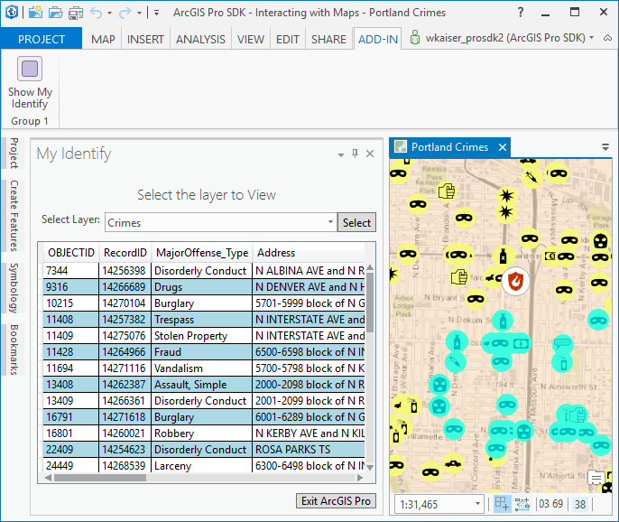

##Lab 3: MVVM, Events, Hooking Commands 

In this lab you will learn how to  
• Customize ArcGIS Pro using a Dockpane add-in based on the MVVM pattern  
• Hooking existing ArcPro commands  
• Subscribe to ArcGIS Pro events  

In order to do this we are using an existing dockpane (called 'IdentifyWindow') solution and enhance the dockpane by adding out-of-box ArcGIS Pro commands, filling a dropdown list with feature layers, and finally displaying selected features in a data grid.  

 

*******
* [Step 1: Open the Lab1 Start Project](#step-1-open-the-lab3-start-project)
* [Step 2: Hooking existing ArcPro commands](#step-2-hooking-existing-arcPro-commands)
* [Step 3: Populate the feature layer dropdown list](#step-3-populate-the-feature-layer-dropdown-list)
* [Step 4: Synchronize UI with data updated by a worker thread](#step-4-synchronize-ui-with-data-updated-by-a-worker-thread)
* [Step 5: Fill the data grid with selected records](#step-5-fill-the-data-grid-with-selected-records)
* [Step 6: Flash the feature for the current selected row on the data grid](#step-6-flash-the-feature-for-the-current-selected-row-on-the-data-grid)

**Estimated completion time: 30 minutes**
****

####Step 1: Open the Lab3 Start Project
* Open Visual Studio and select Open Project.  
* Navigate to your `Labs\Day1\Lab 3\Start` folder (should be at `C:\ProSDKWorkshop\arcgis-pro-sdk-workshop-2day-master\Labs\Day1\Lab 3\Start`) and open the IdentifyWindow.sln.
* Notice that the XAML for this solution has already been defined, however, code behind functionality is not working yet.  
* Build and run the solution.  Notice that none of the buttons are working yet.  

####Step 2: Hooking existing ArcPro commands  

The idenfity dockpane has two buttons: *Select* (select by rectangle tool) and *Exit ArcGIS Pro* let's use the out-of-box ArcGIS Pro functionality for these buttons.  
Search for *TODO: Step2:* in the XAML file and add the command behind for both buttons.  Command binding should look like this:  

```xml
<Button Grid.Column="2" Content="Select" Padding="5,0,5,0" Command="{Binding Path=SelectionTool}"></Button>
```  
Search for *TODO: Step2:* in the view model source code and add the ICommand properties and definitions. The ICommand properties are implemented using the RelayCommand class:

```cs  
var toolWrapper = FrameworkApplication.GetPlugInWrapper(DAML.Tool.esri_mapping_selectByRectangleTool);
var toolCmd = toolWrapper as ICommand; // tool and command(Button) supports this
if (toolCmd != null)
{
    SelectionTool = new RelayCommand(func => toolCmd.Execute(null),
                    func => toolCmd.CanExecute(null));
}

```

In order to test the command, debug the add-in and open a project for example *C:\ProSDKWorkshop\Data\Projects\Interacting with Maps* and test the *Select* button of the identify add-in.  Once you click the button you should see that the selection by rectangle tool has been activated.  Click the *Exit ArcGIS Pro* button to see ArcGIS Pro close.  

####Step 3: Populate the feature layer dropdown list  

The idenfity dockpane has a ComboBox that holds the list of feature layers that are available in the current map pane.  
Search for *TODO: Step3:* in the XAML file and add the data binding to the ComboBox.  Data binding should look like this:  

```xml
<ComboBox Grid.Column="1" ItemsSource="{Binding FeatureLayers}" 
          DisplayMemberPath="Name" SelectedItem="{Binding SelectedFeatureLayer}" />
```  
Search for *TODO: Step3:* in the view model source code and subscribe to the *Active MapView Changed* and *Active Pane Changed* events, by enabling the subscription code.  

```cs  
 ActiveMapViewChangedEvent.Subscribe(OnActiveMapViewChanged);
 ActivePaneChangedEvent.Subscribe(OnActivePaneChanged);

```

In order to test the command, debug the add-in and open a project for example *C:\ProSDKWorkshop\Data\Projects\Interacting with Maps*.  You should get this error as the feature layer list is getting populated:  

 

This error indicates that UI data cannot be updated from a worker thread without proper synchronization.  This problem is fixed in the next step.  

####Step 4: Synchronize UI with data updated by a worker thread

In this step we provide the proper synchronization code so that the feature layers collection (_featureLayers) that is displayed by the UI thread can be updated from a worker thread.  We use the .Net BindingOperations class for that.  
Search for *TODO: Step4:* in the view model source code and add the synchronization method for worker thread updating of _featureLayers.  

```cs  
BindingOperations.EnableCollectionSynchronization(_featureLayers, _lockFeaturelayers);
```

In order to test the drop down, debug the add-in and open a project for example *C:\ProSDKWorkshop\Data\Projects\Interacting with Maps*.  The feature layer list should now be properly filled with data.  

####Step 5: Fill the data grid with selected records

The idenfity dockpane has a data grid that holds the selected features of the feature layer that is currently selected in the feature layer dropdown list.  
Search for *TODO: Step5:* in the XAML file and see the databinding for *SelectedItem* and *ItemsSource*.  The data binding looks like this:  

```xml
    <DataGrid Grid.Row="2" Margin="5" Name="selectedFeatureGrid"   
                ...
                SelectedItem="{Binding Path=SelectedFeature}"
                ItemsSource="{Binding Path=SelectedFeatureDataTable, Mode=OneWay}"  >
```  
Search for *TODO: Step5:* in the view model source code and subscribe to the *Map Selection Changed* event.  This event is used to populate the selected features whenever the feature selection on the current map pane changes. The code should look like this:   

```cs  
 MapSelectionChangedEvent.Subscribe(OnMapSelectionChanged);
 
```

In order to test the selection, debug the add-in and open a project for example *C:\ProSDKWorkshop\Data\Projects\Interacting with Maps*.  
After the list of feature layers is populated select *Crimes* and then click the *Select* button.  Select (by rectangle) a few features on the map and see the data grid being populated with data.  To debug the code search for *TODO: Step5: Step into these functions to see how they work* in the view model source code.  
Also note that after the data grid is populated the map view zooms to the extent of the selected layers.  

 

####Step 6: Flash the feature for the current selected row on the data grid

Finally we will add some feedback when a row in the data grid is selected.  As a simple feedback we flash the feature on the map view that corresponds to the selected data grid row.  
Search for *TODO: Step6:* in the view model source code and add the flash feature code when the *SelectedFeature* changes. The code should look like this:   

```cs  
IReadOnlyDictionary<BasicFeatureLayer, List<long>> flashFeature = new Dictionary<BasicFeatureLayer, List<long>>()
                    {{SelectedFeatureLayer, new List<long>(){Convert.ToInt64(_selectedFeature.Row["ObjectId"])}}};
FlashFeaturesAsync(flashFeature);
 
```

In order to test the selection feedback, debug the add-in and open a project for example *C:\ProSDKWorkshop\Data\Projects\Interacting with Maps*.  Select features to fill the data grid and then click on any row to trigger the *flashing* feedback on the map view.  


