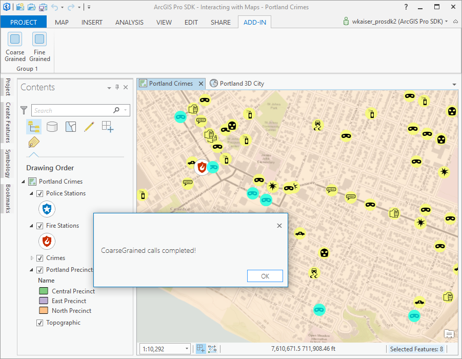
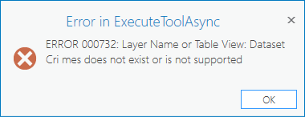
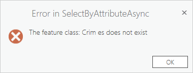

##Lab 4: Coarse and Fine grained functions 

In this lab you will learn how to  
• The difference between coarse grained and fine grained functions  
• How to handle errors that occur in coarse grained functions  
• See fine grained functions in action  
• Write your own coarse grained function    

In order to do this we are using a two button add-in (called 'CoarseFineGrained') solution and coarse and fine grained functions in the code behind for these buttons.  

 

*******
* [Step 1: Open the Lab4 Start Project](#step-1-open-the-lab4-start-project)
* [Step 2: Coarse Grained - select features using where clause and then zoom to selection](#step-2-coarse-grained---select-features-using-where-clause-and-then-zoom-to-selection)
* [Step 3: Coarse Grained - correct the layer name and where clause](#step-3-coarse-grained---correct-the-layer-name-and-where-clause)
* [Step 4: Coarse Grained - Zoom to the selection](#step-4-coarse-grained---zoom-to-the-selection)
* [Step 5: Fine Grained - select features using where clause and then zoom to selection](#step-5-fine-grained---select-features-using-where-clause-and-then-zoom-to-selection)
* [Step 6: Fine Grained - correct the layer name and where clause](#step-6-fine-grained---correct-the-layer-name-and-where-clause)

**Estimated completion time: 20 minutes**
****


####Step 1: Open the Lab4 Start Project
* Open Visual Studio and select Open Project.  
* Navigate to your `Labs\Day1\Lab 4\Start` folder (should be at `C:\ProSDKWorkshop\arcgis-pro-sdk-workshop-2day-master\Labs\Day1\Lab 4\Start`) and open the CoarseFineGrained.sln.
* Notice that the DAML defines the two buttons needed for the lab are already included in your Config.daml.  

####Step 2: Coarse Grained - select features using where clause and then zoom to selection  

In this step we add code behind for the 'Coarse grained' button that calls some coarse grained API functions. Remember that these functions usually end with *Async*.  
Search for *TODO: Step2:* in the *CoarseGrained* source code and add a code snippet calling some coarse grained functions with error handling, by simply uncommenting this following code block.  

```cs  
await Geoprocessing.ExecuteToolAsync(
...
});
```

In order to test the coarse grained function, debug the add-in and open the project at *C:\ProSDKWorkshop\Data\Projects\Interacting with Maps*.  Click on the *Coarse grained* button.  

Notice the following error that occures in the coarse grained function:  

 

We fix this error in the next step.  

####Step 3: Coarse Grained - correct the layer name and where clause

Search for *TODO: Step3:* in the *CoarseGrained* source code and correct the feature layer name and the where clause as follows:  

```cs  
await Geoprocessing.ExecuteToolAsync(
	"SelectLayerByAttribute_management", new string[] {
		"Crimes","NEW_SELECTION","Major_Offense_Type = 'Larceny' And Neighborhood = 'CATHEDRAL PARK'"
	}).ContinueWith(t =>
				...
```  

Debug the add-in and open the project at *C:\ProSDKWorkshop\Data\Projects\Interacting with Maps*.  Click on the *Coarse grained* button. The function should now work properly.  

####Step 4: Coarse Grained - Zoom to the selection

Search for *TODO: Step4:* in the *CoarseGrained* source code and add another coarse grained function (ZoomToSelectedAsync) by uncommenting the following code:  

```cs  
await MapView.Active.ZoomToSelectedAsync(new TimeSpan(0, 0, 3), true);
```
Debug the add-in and open the project at *C:\ProSDKWorkshop\Data\Projects\Interacting with Maps*.  Click on the *Coarse grained* button. The function should now work properly and zoom to the selection.  

####Step 5: Fine Grained - select features using where clause and then zoom to selection  

In this step we add code behind for the 'Fine grained' button that calls a series of fine grained API functions encapsulated in a coarse grained function (Module1.SelectByAttributeAsync). Remember that fine grained functions have to be called using *QueuedTask.Run*.  
Search for *TODO: Step5:* in the *FineGrained* source code and add a code snippet calling the Module1.SelectByAttributeAsync (coarse grained) function with error handling, by simply uncommenting this following code block.  

```cs  
await Module1.SelectByAttributeAsync(featureLayerName, featureSelectClause)
...
});
```

In order to test the fine grained functions, debug the add-in and open the project at *C:\ProSDKWorkshop\Data\Projects\Interacting with Maps*.  Click on the *Fine grained* button.  

Notice the following error that occures in Module1.SelectByAttributeAsync:  

 

We fix this error in the next step.  

####Step 6: Fine Grained - correct the layer name and where clause  

Search for *TODO: Step6:* in the *FineGrained* source code and correct the feature layer name and the where clause as follows:  

```cs  
var featureLayerName = "Crimes";
var featureSelectClause = "Major_Offense_Type <> 'Larceny' And Neighborhood = 'CATHEDRAL PARK'";
```  

Debug the add-in and open the project at *C:\ProSDKWorkshop\Data\Projects\Interacting with Maps*.  Click on the *Fine grained* button. The function should now work properly.  
