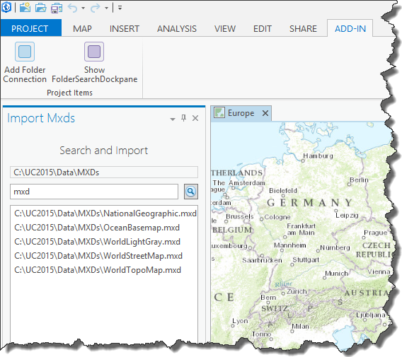

##Lab 5: Project Items

#####In this lab you will learn how to
* Access project items in the current project
* Add new project items to the project
* Create a Dockpane in DAML
* Use the MVVM pattern with ArcGIS Pro
* Import an Mxd to create a new map

*******
* [Step 1: Add a folder connection to the project](#step-1-add-a-folder-connection-to-the-project)
* [Step 2: Add a Dockpane](#step-2-add-a-dockpane)
* [Step 3: Customize the Dockpane](#step-3-customize-the-dockpane)
* [Step 4: Import the selected Mxd](#step-4-import-the-selected-mxd)

**Estimated completion time: 30 minutes**
****

####Step 1: Add a folder connection to the project
* Navigate in your copy of arcgis-pro-sdk-workshop repo to this folder:
C:\ProSDKWorkshop\arcgis-pro-sdk-workshop-2day-master\Labs\Day 1\Lab 5\Start

* Open the "ProjectItems" solution in the Start folder.

* Take a minute to look at the solution. See that there is an empty button called AddFolderConnection. Check the config.daml file to see how the button is configured.

* Once you're ready to start work, open the AddFolderConnection.cs file. 

* Uncomment the code in the OnClick method.

* Add the keyword ```async``` to the OnClick method declaration.
```protected async override void OnClick()```

* Inspect the OnClick implementation.  Notice the following
    - ItemFactory.Create method to create a new Item
    - Project.Current.AddAsync method to add a new ProjectItem
    - the await on the Project.Current.AddAsync line.

* Your method should look like the following

```c#
    protected async  override void OnClick()
    {
      // add a folder connection
      Item item = ItemFactory.Create(Module1.FolderPath);
      IEnumerable<ProjectItem> folders = await Project.Current.AddAsync(item);

      // double check - ensure it has been created
      FolderConnectionProjectItem folder = folders.First() as FolderConnectionProjectItem;
      if (folder != null)
        ArcGIS.Desktop.Framework.Dialogs.MessageBox.Show("Folder added " + folder.Path, "Project Items Lab", System.Windows.MessageBoxButton.OK, System.Windows.MessageBoxImage.Information);
      else
        ArcGIS.Desktop.Framework.Dialogs.MessageBox.Show("No folder added", "Project Items Lab", System.Windows.MessageBoxButton.OK, System.Windows.MessageBoxImage.Exclamation);
    }
```

* Note this line:
```c#
Item item = ItemFactory.Create(Module1.FolderPath);
```

In your Module1.cs, the FolderPath property is set as ```public static string FolderPath = @"C:\ProSDKWorkshop\Data\MXDs";```

If you copied your data folder to a different location you will need to change that path accordingly.

* Build the solution. Create a new project using the Map.aptx template. Use the default location and name when prompted and click 'OK'. 

* After the project has opened, click the ADD-IN tab. Validate that there is now an "Add Folder Connection" button on the ribbon.  

* Click the button and verify that a new folder connection to C:\ProSDKWorkshop\Data\MXDs is created (or the location of your Data\MXDs folder).  You can verify a new folder connection by opening the Project pane and expanding the Folders container. You should see any entry for MXDs.  Expand this folder and you should see 5 MXDs files listed. 

Note: You will get a message box either confirming the folder being added or an error when you click the button. If there was an error check your path to the MXDs folder.

* <u>**Save**</u> the project. Stop the debugger.

####Step 2: Add a Dockpane
* In Visual Studio right-click the ProjectItems project node and select Add | New Item.  In the Add New Item dialog, navigate to Visual C# Items | ArcGIS | ArcGIS Pro Add-ins and Select ArcGIS Pro Dockpane.  Rename the default name Dockpane1.xaml to FolderSearchDockpane.xaml in the Add New Item dialog.  Click ok.

* The add-in template added a FolderSearchDockpane.xaml and FolderSearchDockpaneViewModel.cs to your project. This is a classic WPF Model View ViewModel, MVVM, pattern which is used to separate the development of the graphical user interface (the View) from the development of the business logic or back-end logic (the viewmodel). FolderSearchDockpane.xaml contains the GUI as XAML markup and FolderSearchDockpaneViewModel.cs the back-end business logic. The following steps will explore the use of MVVM in the context of an ArcGIS Pro add-in.

* Build the solution.  

####Step 3: Customize the Dockpane

* In order to change our dockpane we make a few simple changes in DAML and the View Model.   

* Open the config.daml file.  Find the dockpane control and change it's caption to "Import Mxds" 

```xml
<dockPane id="ProjectItems_FolderSearchDockpane" caption="Import Mxds" 
    className="FolderSearchDockpaneViewModel" dock="group" dockWith="esri_core_contentsDockPane">
  <content className="FolderSearchDockpaneView" />
</dockPane>
```

* Now we will make changes to the dockpane content.   Open the FolderSearchDockpaneViewModel.cs file and navigate to the "Heading" property.  Note that this property is initialized with "My DockPane".  Change this to "Search and Import".  

```c#
private string _heading = "Search and Import";
public string Heading
{
   get { return _heading; }
   set
   {
      SetProperty(ref _heading, value, () => Heading);
   }
}
```

* Modify the view and add some additional controls.  We are going to add
    - a TextBlock to display the folder being searched
    - a TextBox to specify the search string
    - a Button to search the folder
    - a ListBox to display the search results

* Open the FolderSearchDockpane.xaml file and replace the default XAML user control implementation. Copy and paste the XAML below over the existing XAML in the UserControl. You will be replacing everything between and including the top-level ```<Grid>...</Grid>``` control. Leave the ```UserControl.Resources``` xaml intact.

```xml
<UserControl.Resources>...</UserControl.Resources>

<!-- Begin copy here -->
  <Grid>
     <Grid.RowDefinitions>
        <RowDefinition Height="Auto"/>
        <RowDefinition Height="Auto"/>
        <RowDefinition Height="Auto"/>
        <RowDefinition Height="*"/>
        <RowDefinition Height="Auto"/>
     </Grid.RowDefinitions>

     <DockPanel Grid.Row="0" LastChildFill="true" KeyboardNavigation.TabNavigation="Local" Height="30">
        <TextBlock Grid.Column="1" Text="{Binding Heading}" VerticalAlignment="Center" HorizontalAlignment="Center"
                FontSize="16" FontWeight="Light">
            <TextBlock.ToolTip>
                <WrapPanel Orientation="Vertical" MaxWidth="300">
                    <TextBlock Text="{Binding Heading}" TextWrapping="Wrap"/>
                </WrapPanel>
            </TextBlock.ToolTip>
        </TextBlock>
     </DockPanel>
      
     <DockPanel Grid.Row="1"  Margin="8,8,8,8">
       <Border DockPanel.Dock="Left" BorderThickness="1" BorderBrush="LightGray" ToolTip="{Binding Folder}">
         <TextBlock Padding="4,0" Text="{Binding Folder, Mode=OneWay}" VerticalAlignment="Center"/>
       </Border>
     </DockPanel>

     <DockPanel Grid.Row="2" LastChildFill="True" Margin="8,0,8,8">
       <Button Margin="8,0,0,0" DockPanel.Dock="Right" HorizontalAlignment="Center" Command="{Binding SearchCommand}" Height="22" VerticalAlignment="Top" >
          <Image Stretch="None" Width="16" Height="16" VerticalAlignment="Center" 
                    Source="pack://application:,,,/ArcGIS.Desktop.Resources;component/Images/GenericSearch16.png"/>
       </Button>
       <TextBox Text="{Binding SearchString}" />
     </DockPanel>

     <ListBox Grid.Row="3" Margin="8,0,8,8" ItemsSource="{Binding SearchResults}" DisplayMemberPath="Path" SelectedItem="{Binding SelectedMxd}">
     </ListBox>
       <!--
        <DockPanel Grid.Row="4" LastChildFill="True" Margin="8,0,8,8">
            <Button Margin="8,0,0,0" Content="Import" DockPanel.Dock="Right" HorizontalAlignment="Right" Command="{Binding ImportMxdCommand}" IsEnabled="{Binding HasMxdSelected}"
              Style="{DynamicResource Esri_SimpleButton}">
            </Button>
        </DockPanel>
        -->
  </Grid>
<!-- End Copy Here -->

</UserControl>
```

* Next we will add the business logic to the FolderSearchDockpaneViewModel.cs file.  Open the class and add the following snippets after the Heading property.

```c#

        /// <summary>
        /// Text shown near the top of the DockPane.
        /// </summary>
        private string _heading = "Search and Import";
        public string Heading
        {
            get { return _heading; }
            set
            {
                SetProperty(ref _heading, value, () => Heading);
            }
        }
        <--- You will Copy/Paste the code below here
    }

    /// <summary>
    /// Button implementation to show the DockPane.
    /// </summary>
    internal class FolderSearchDockpane_ShowButton : Button
    {
```

This is the code to copy and paste

```c#
    /// <summary>
    /// Performed on uninitialization of the dockpane
    /// </summary>
    /// <returns></returns>
    protected override Task UninitializeAsync()
    {
      // disconnect all the commands
      if (_searchCommand != null)
        _searchCommand.Disconnect();
      _searchCommand = null;

      //if (_importMxdCommand != null)
      //  _importMxdCommand.Disconnect();
      //_importMxdCommand = null;

      return base.UninitializeAsync();
    }

    /// <summary>
    /// The folder to be searched
    /// </summary>
    private string _folder = Module1.FolderPath;
    public string Folder
    {
      get { return _folder; }
      set { SetProperty(ref _folder, value, () => Folder); }
    }

    /// <summary>
    /// The search string
    /// </summary>
    private string _searchString = "mxd";
    public string SearchString
    {
      get { return _searchString; }
      set { SetProperty(ref _searchString, value, () => SearchString); }
    }

    /// <summary>
    /// The search results
    /// </summary>
    private List<Item> _searchResults;
    public List<Item> SearchResults
    {
      get { return _searchResults; }
      set { SetProperty(ref _searchResults, value, () => SearchResults); }
    }

    /// <summary>
    /// a RelayCommand to search the folder
    /// </summary>
    private RelayCommand _searchCommand;
    public ICommand SearchCommand
    {
      get
      {
        if (_searchCommand == null)
          _searchCommand = new RelayCommand(() => this.Search());
        return _searchCommand;
      }
    }

    /// <summary>
    /// Performs the search
    /// </summary>
    /// <returns>A Task to the search function</returns>
    private async Task Search()
    {
      // reset the results
      SearchResults = null;

      // verify there is a folder
      if (string.IsNullOrEmpty(Folder))
        return;

      // find the folder project item
      FolderConnectionProjectItem folder = Project.Current.GetItems<FolderConnectionProjectItem>().FirstOrDefault(f => f.Path == Folder);
      if (folder == null)
        return;

      // do the search
      IEnumerable<Item> results = await folder.SearchAsync(SearchString);

      // assign to the results variable
      SearchResults = results.ToList();
    }

    /// <summary>
    /// Is there a selected mxd item
    /// </summary>
    private Item _selectedItem;
    public Item SelectedMxd
    {
      get { return _selectedItem; }
      set
      {
        SetProperty(ref _selectedItem, value, () => SelectedMxd);
        // refresh the HasMxdSelected for the view
        NotifyPropertyChanged(() => HasMxdSelected);
      }
    }

    /// <summary>
    /// Has an Mxd been selected
    /// </summary>
    public bool HasMxdSelected
    {
      get { return _selectedItem != null; }
    }
```

* Resolve all the undefined objects. You will need to add the following 3 using statements to the top of the View Model (or just right-click on each error in the code window and select 'Resolve' from the VisualStudio context menu to add them automatically)

```
using ArcGIS.Desktop.Catalog;
using ArcGIS.Desktop.Core;
using System.Windows.Input;
```

* Compile and run the Add-in. Open the project you created in Step 1.  

* After the project has opened, click the ADD-IN tab.

* Click on the Show FolderSearchDockpane button to show the Dockpane.

* The location TextBlock is bound to the Folder property of the ViewModel.  

* The search input field should show the text "mxd".

* Click the search button on the Dockpane. 

* The contents of the C:\ProSDKWorkshop\Data\MXDs folder that matches the search string "mxd" should be loaded into the Listbox.



The search button executes the ```private async Task Search()``` method you added to your View Model. Examine the code. Notice that it retrieves your folder connection to C:\ProSDKWorkshop\Data\MXDs and searches that folder for the item content matching the search string &quot;mxd&quot;

```c#
private async Task Search()
{
...
      FolderConnectionProjectItem folder = Project.Current.GetItems<FolderConnectionProjectItem>().FirstOrDefault(f => f.Path == Folder);
...
      IEnumerable<Item> results = await folder.SearchAsync(SearchString);
...
}
```

#### Review
Your code modifications dove deeper into MVVM.   
* We added a number of string properties "Folder" and "SearchString" to the ViewModel.  These have both getter and setter properties.  
* We used WPF binding to bind their values to the TextBlock and TextBox controls in the Dockpane view. 
* We added a button "Search" to retrieve the list of items in the folder. 
* The button has a Command property which binds to a RelayCommand SearchCommand in the viewmodel.
* The SearchCommand's Execute method is the Search method. 
* The Search method accessed the project folder connections, retrieved the folder item we were interested in searching and used the SearchAsync method to find the items matching our SearchString.  
* These items were then assigned to the SearchResults property of the View Model.
* The ListBox is bound to the SearchResults and is updated when the search finishes. 

Inspect the code until you are sure you understand the MVVM concepts of binding and are ready to continue.

####Step 4: Import the selected Mxd
* In this step we will add a WPF button to the bottom of the dockpane to import the selected Mxd to the project.  

* Open the FolderSearchDockpane.xaml file and uncomment the following XAML snippet after the ```<ListBox>...</ListBox>``` section

```xml
    ...
  </ListBox>

     <!--
      <DockPanel Grid.Row="4" LastChildFill="True" Margin="8,0,8,8">
        <Button Margin="8,0,0,0" Content="Import" DockPanel.Dock="Right" HorizontalAlignment="Right" Command="{Binding ImportMxdCommand}" IsEnabled="{Binding HasMxdSelected}"
                Style="{DynamicResource Esri_SimpleButton}">
        </Button>
      </DockPanel>
    -->
</Grid>
```

* This adds our WPF button to the dockpane.  Notice the bindings for the Command and IsEnabled properties. 

* To add our business logic, open the FolderSearchDockpaneViewModel.cs file and add the following  code at the bottom of the View Model class.

```c#
    /// <summary>
    /// Implement a RelayCommand to import the selected mxd
    /// </summary>
    private RelayCommand _importMxdCommand;
    public ICommand ImportMxdCommand
    {
      get
      {
        if (_importMxdCommand == null)
          _importMxdCommand = new RelayCommand(() => this.ImportMxd());
        return _importMxdCommand;
      }
    }

    /// <summary>
    /// Imports the selected mxd to the project
    /// </summary>
    internal async Task ImportMxd()
    {
      // verify that a map can be created from the selection
      if (MapFactory.CanCreateMapFrom(SelectedMxd))
      {
        // creates a new map and adds it to the project.  Also opens the mapview
        Map map = await MapFactory.CreateMapAsync(SelectedMxd); 
      }
    }
```

* Resolve the reference for MapFactory. You will need a ```using ArcGIS.Desktop.Mapping;```

* Go to the UninitializeAsync method and uncomment the 3 lines referencing the _importMxdCommand variable.

```c#
protected override Task UninitializeAsync()
        {
            // disconnect all the commands
            if (_searchCommand != null)
                _searchCommand.Disconnect();
            _searchCommand = null;

            //if (_importMxdCommand != null)  <-- Uncomment these lines
            //  _importMxdCommand.Disconnect(); <--
            //_importMxdCommand = null;       <--

            return base.UninitializeAsync();
        }
```

*  Compile and run. Open your project in Pro. Verify the new UI on the dockpane.  
* See how the Import button is initially disabled until the search is performed and an Mxd is selected (check the ```IsEnabled="{Binding HasMxdSelected}``` binding on the Import button in the xaml).  
* Execute the search and populate the list box with MXDs
* Select an mxd in the listbox
* Verify that the Import button enables
* Click the Import button 
* Verify that a new map project item is created in the project and the map is opened. 

The code executed by the Import button is in the ImportMxd method in the View Model

```c#
internal async Task ImportMxd()
        {
            // verify that a map can be created from the selection
            if (MapFactory.CanCreateMapFrom(SelectedMxd))
            {
                // creates a new map and adds it to the project.  Also opens the mapview
                Map map = await MapFactory.CreateMapAsync(SelectedMxd);
            }
        }
```

* Stop the debugger. 
