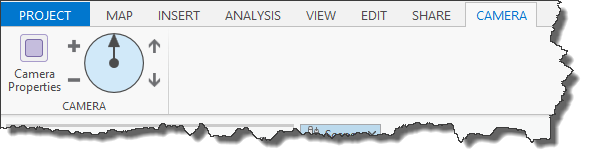

##Lab 2: Navigating the map view using the camera

#####In this lab you will learn how to
* Explore different properties of the camera
* Get and set the camera for a map view
* Subscribe to mapping events
* Create a custom control in the ribbon to navigate the active map view

*******
* [Step 1: Explore different properties of the camera](#step-1-explore-different-properties-of-the-camera)
* [Step 2: Add behavior to zoom buttons](#step-2-add-behavior-to-zoom-buttons)
* [Step 3: Add behavior to heading slider control](#step-3-add-behavior-to-heading-slider-control)
* [Step 4: Add behavior to pitch buttons (bonus)](#step-4-add-behavior-to-pitch-buttons-bonus)

**Estimated completion time: 30 minutes**
****

####Step 1: Explore different properties of the camera
* Navigate in your cloned arcgis-pro-sdk-workshop repo to this folder: C:\ProSDKWorkshop\arcgis-pro-sdk-workshop-2day-master\Labs\Day 2\Lab 2\Start.

* Open the "Navigate Camera" solution in the Start folder.

* Build and run the solution. This should launch ArcGIS Pro and open the &quot;C:\ProSDKWorkshop\Data\Projects\Interacting with Maps\Interacting with Maps.aprx&quot; project.

* A Camera tab should display in ArcGIS Pro’s Ribbon. The tab has two buttons. One is defined as a button, the other as a custom control. The custom control also uses MVVM. 

* Without closing ArcGIS Pro go back to the Visual Studio and examine the Config.daml file. Find the ```customControl``` element and notice how the DAML references a view (CameraControl.xaml) for its UI and a view model (CameraControlViewModel.cs) for its business logic.

```xml

<customControl id="NavigateCamera_CameraControl" caption="Camera Control" className="CameraControlViewModel" 
loadOnClick="false" condition="esri_mapping_mapPane">
          <content className="CameraControl" />
</customControl>
```



* On the Camera tab, the custom control currently does nothing. We will add behavior to this control later on in the lab.

* From the Camera tab click the Camera Properties button. This will open a new Camera Properties dockpane which will display the properties of the camera.

* Navigate around the 2D and 3D views, notice how the camera properties update on the dockpane

* Now experiment with changing the X or Y value on the dock pane and click the magnifying glass ("zoom to") button. The view should move to that camera position.

* Repeat above with the heading. Notice how this is equivilant to adjusting the rotation.

* Try changing the pitch and compare the difference in 2D vs 3D.

* Stop debugging to proceed on with the lab.

* Investigate the CameraPane.xaml and CameraPaneViewModel.cs files.

####Step 2: Add behavior to zoom buttons
* In the Navigate Camera solution open the CameraControlViewModel.cs file. Uncomment the code in the Zoom Commands region.

* As before (in the morning labs) we will be using the Framework class ```RelayCommand``` to implement the ICommands needed for our custom control.

* In the CameraControlViewModel's **constructor** intialize the _zoomInCmd using the ZoomIn method and the CanZoom method. It would look something like this:

```c#
  _zoomInCmd = new RelayCommand(() => ZoomIn(), () => CanZoom());
```
* Do the same for _zoomOutCmd but for the Execute delegate pass in ZoomOut.

```c#
  _zoomOutCmd = new RelayCommand(() => ZoomOut(), () => CanZoom());
```

```c# 
  public CameraControlViewModel()
  {
   //TODO initialize the zoom in and zoom out RelayCommands.
   _zoomInCmd = new RelayCommand(() => ZoomIn(), () => CanZoom());
   _zoomOutCmd = new RelayCommand(() => ZoomOut(), () => CanZoom());

   //TODO subscribe to MapViewCameraChangedEvent and ActiveMapViewChangedEvent.

   //TODO initialize the pitch up and pitch down RelayCommands.

   //TODO initialize the heading by calling SetHeadingFromMapView and passing in the active map view.
 }
```

* Ignore the errors. You are going to implement the ZoomIn, ZoomOut and CanZoom methods next. 

* Now add logic to CanZoom to return **true** if there is an active map view otherwise return false. Use the static Active property on MapView (```MapView.Active != null;```).

```c#
private bool CanZoom()
    {
        //TODO return true if the active map view is not null.
        return MapView.Active != null;
    }
```

* Implement the ZoomIn and ZoomOut methods. The MapView instance has two methods ZoomInFixedAsync and ZoomOutFixedAsync that can be used to accomplish this task. Get the active map view and call the corresponding method for each.

```c#
private void ZoomIn()
    {
        //TODO zoom the active view in by a fixed amount.
        MapView.Active.ZoomInFixedAsync(TimeSpan.FromSeconds(.25));
    }
    
    private void ZoomOut()
    {
        //TODO zoom the active view in by a fixed amount.
        MapView.Active.ZoomOutFixedAsync(TimeSpan.FromSeconds(.25));
    }
```

Adjust the TimeSpan to increase or decrease Pro's animation effect when you change extent.

* Open **CameraControl.xaml**. You must bind the repeating buttons for zoom in and out to the zoom in and out ICommands on the view model. Note the addition of the ```Command="{Binding Path=ZoomInCmd}``` and ```Command="{Binding Path=ZoomOutCmd}"``` attributes in the CameraControl.xaml.

```XML
<RepeatButton ... x:Name="ZoomIn" Command="{Binding Path=ZoomInCmd}">
  <RepeatButton.Content>
    <Image HorizontalAlignment="Center" ...
    ...
</RepeatButton>
<RepeatButton ... x:Name="ZoomOut" Command="{Binding Path=ZoomOutCmd}">
  ...
</RepeatButton>
 ```

* Uncomment the ```ZoomInCmd``` and ```ZoomOutCmd``` properties in the CameraControlViewModel.

```c#
 private RelayCommand _zoomInCmd;
    public ICommand ZoomInCmd
    {
        get { return _zoomInCmd; }
    }
    
     private RelayCommand _zoomOutCmd;
    public ICommand ZoomOutCmd
    {
        get { return _zoomOutCmd; }
    }
```

* Build the solution and run it. Open the &quot;C:\ProSDKWorkshop\Data\Projects\Interacting with Maps\Interacting with Maps.aprx&quot; project.

* Test out the behavior of the "Plus" and "Minus" buttons on the Camera tab. Verify that you are able to zoom in and out in both 2D and 3D.

* The zoom in and out buttons are of type ```RepeatButton``` so you should be able to hold either button down and continuously adjust the zoom.

* Stop debugging to proceed on with the lab.

####Step 3: Add behavior to heading slider control
* In the Navigate Camera solution open the CameraControlViewModel.cs file.

* Uncomment the code in the Adjust Heading region.

```c#
#region Adjust Heading
...
//Uncomment all the code in this region in the View Model
...
#endregion
```

* There are two public properties in this section of code, IsCameraEnabled and HeadingValue.  Both are bound to the slider control in the CameraControl view.  IsCameraEnabled is bound to the IsEnabled property of the slider and HeadingValue is bound to the Value property.
* Examine the binding in the CameraControl.xaml on the Slider control.

```xml
  <Slider Grid.Row="0" ... Value="{Binding Path=HeadingValue,... 
     IsEnabled="{Binding IsCameraEnabled}" >            

```
* In the CameraControlViewModel's constructor subscribe to the MapViewCameraChangedEvent and pass in OnCameraChanged. 

* Subscribe to the ActiveMapViewChangedEvent as well and pass in OnActiveViewChanged.

```C#
public CameraControlViewModel()
    {
      //TODO initialize the zoom in and zoom out RelayCommands.
        _zoomInCmd = new RelayCommand(() => ZoomIn(), () => CanZoom());
        _zoomOutCmd = new RelayCommand(() => ZoomOut(), () => CanZoom());

      //TODO subscribe to MapViewCameraChangedEvent and ActiveMapViewChangedEvent.
        MapViewCameraChangedEvent.Subscribe(OnCameraChanged);
        ActiveMapViewChangedEvent.Subscribe(OnActiveViewChanged);

      //TODO initialize the pitch up and pitch down RelayCommands.

      //TODO initialize the heading by calling SetHeadingFromMapView and passing in the active map view.
    }
```

* In SetHeadingFromMapView we need to test if the MapView is null. 
1. If MapView.Active is null there is no active map view. Set IsCameraEnabled = false. 
2. If MapView.Active is **not** null:  
  * Get the Camera from the map view and set it to the Camera property on the ViewModel. 
   * Set the IsCameraEnabled = true
   * Call the private method ```SetHeading()```.

```C#
private void SetHeadingFromMapView(MapView mapView) {
   //TODO test if mapView is null.
   //If not null set IsCameraEnabled to true
   //get the Camera from the mapView (mapView.GetCameraAsync())
   //call SetHeading().
   if (mapView != null) 
   {
     Camera = mapView.Camera;
     IsCameraEnabled = true;
     SetHeading();
   }
   else 
   {
      //If null set "IsCameraEnabled = false".
     IsCameraEnabled = false;         
   }
}
```
* Look at the code in the SetHeading method. Here we are doing the conversion from the Camera heading of -180 to 180 to the Slider values of 0 to 360. Next we are calling SetProperty (which is a convenience method off of the PropertyChangedBase class provided by the Framework). Our custom control is bound to ```HeadingValue``` and raising its property notification updates our slider position (i.e. the "arm" of the circle) in response to a change in the heading of the map view camera.

```C#
 private void SetHeading() {
      if (Camera != null) {
          double viewHeading = Camera.Heading < 0 ? 360 + Camera.Heading : Camera.Heading;
          SetProperty(ref _headingValue, viewHeading, () => HeadingValue);
      }
 }
```

* In the setter of the HeadingValue we are converting the value on the slider (or "circle") which ranges from 0 to 360 to a Heading for the Camera which ranges from -180 to 180 and then setting that heading on the local Camera property of the ViewModel.

* Add behavior in the HeadingValue setter to zoom the active map view to the new Camera (set by the control). Hint: examine  the ZoomToAsync() method of mapview.

```C#

public double HeadingValue {
   get { return _headingValue; }  
   set {
      double cameraHeading = value > 180 ? value - 360 : value; 
      _headingValue = value;
      Camera.Heading = cameraHeading;
      //TODO get the active map view and zoom to the new camera.
      MapView activeMapView = MapView.Active;
      if (activeMapView != null)
          activeMapView.ZoomToAsync(Camera, TimeSpan.FromSeconds(.25));
   }
}
```

* Finally in the ViewModel constructor we should call SetHeadingFromMapView and pass in the active map view to initialize the control.

```C#
public CameraControlViewModel()
    {
      //TODO initialize the zoom in and zoom out RelayCommands.
        _zoomInCmd = new RelayCommand(() => ZoomIn(), () => CanZoom());
        _zoomOutCmd = new RelayCommand(() => ZoomOut(), () => CanZoom());

      //TODO subscribe to MapViewCameraChangedEvent and ActiveMapViewChangedEvent.
        MapViewCameraChangedEvent.Subscribe(OnCameraChanged);
        ActiveMapViewChangedEvent.Subscribe(OnActiveViewChanged);

      //TODO initialize the pitch up and pitch down RelayCommands.

      //TODO initialize the heading by calling SetHeadingFromMapView and passing in the active map view.
        SetHeadingFromMapView(MapView.Active);
    }
```

* Build the solution and run it.  Open the &quot;C:\ProSDKWorkshop\Data\Projects\Interacting with Maps\Interacting with Maps.aprx&quot; project.

* Test out the behavior of the heading slider control. Dragging the arrow around the control should rotate the map view. Press and hold the **'V'** key on the keyboard and click and drag in the map view to rotate the view. Verify that the slider updates to reflect the adjusted heading in the view.

* Stop Debugging to proceed on with the lab.

####Step 4: Add behavior to pitch buttons (bonus)
* In the Navigate Camera solution open the CameraControlViewModel.cs file.

* Similar to what we did for the zoom ICommands, initialize the RelayCommands for pitch down and pitch up in the ViewModel constructor.

```C#
   public CameraControlViewModel()
    {
      //TODO initialize the zoom in and zoom out RelayCommands.
        _zoomInCmd = new RelayCommand(() => ZoomIn(), () => CanZoom());
        _zoomOutCmd = new RelayCommand(() => ZoomOut(), () => CanZoom());

      //TODO subscribe to MapViewCameraChangedEvent and ActiveMapViewChangedEvent.
        MapViewCameraChangedEvent.Subscribe(OnCameraChanged);
        ActiveMapViewChangedEvent.Subscribe(OnActiveViewChanged);

        //TODO initialize the pitch up and pitch down RelayCommands.
        _pitchDownCmd = new RelayCommand(() => PitchDown(), () => CanAdjustPitch());
        _pitchUpCmd = new RelayCommand(() => PitchUp(), () => CanAdjustPitch());

      //TODO initialize the heading by calling SetHeadingFromMapView and passing in the active map view.
        SetHeadingFromMapView(MapView.Active);
    }
```

* Ignore the errors. You will implement the missing PitchDown, PitchUp, and CanAdjustPitch() methods next.

* Uncomment the code in the Pitch Commands region.

```c#
#region Pitch Commands
...
//Uncomment all the code in this region in the View Model
...
#endregion
```

* In CanAdjustPitch we want to return true if the active map view is not null **and** we are currently working with a 3D view. This is because adjusting pitch has no effect in 2D. Hint: test ```MapView.Active.ViewingMode``` to make sure our mode is not equal to "Map".

```C#
 private bool CanAdjustPitch()
    {
        //TODO return true if there is an active map view and the view is a 3D view.
        return MapView.Active != null && MapView.Active.ViewingMode != MapViewingMode.Map;
    }

```
* In the PitchUp method we will increase our pitch in increments of 5 degrees. Keep incrementing the pitch by 5 degrees until our pitch is greater than or equal to 90 deg. When the camera pitch has been updated zoom the active map view to the new Camera. Hint: ```this.Camera.Pitch += 5;  MapView.Active... ```

```c#
private void PitchUp()
    {
        //TODO if the camera's pitch is less than 90 add 5 and zoom to the new camera.
        if (Camera.Pitch < 90)
        {
            Camera.Pitch += 5;
            MapView.Active.ZoomToAsync(Camera, TimeSpan.FromSeconds(.25));
        }
    }
```

* In the PitchDown method decrement our Camera's pitch until it is less than or equal to -90 degrees. Zoom the active map view to the new camera. Hint: ```Camera.Pitch -= 5; ...```

```c#
private void PitchDown()
    {
        //TODO if the camera's pitch is greater than -90 subtract 5 and zoom to the new camera.
        if (Camera.Pitch > -90)
        {
            Camera.Pitch -= 5;
            MapView.Active.ZoomToAsync(Camera, TimeSpan.FromSeconds(.25));
        }
    }
```

* Open the CustomControl.xaml file. You must bind the repeating buttons for pitch up and pitch down to the PitchUpCmd and PitchDownCmd ICommand properties on the view model. Do you remember how? Hint: look at step 2 in this lab. You will bind apitch command to the pitch RepeatButton's Command attribute.

```xml
<RepeatButton ... x:Name="PitchUp" Command="{Binding Path=PitchUpCmd}">
            <RepeatButton.Content>
                <Image HorizontalAlignment="Center" ...
            ...
 <RepeatButton ... x:Name="PitchDown" Command="{Binding Path=PitchDownCmd}">
            <RepeatButton.Content>
```

* Build the solution and run it. Open the &quot;C:\ProSDKWorkshop\Data\Projects\Interacting with Maps\Interacting with Maps.aprx&quot; project.

* Test out the behavior of the up and down arrow buttons on the Camera tab. Verify that it adjusts the Pitch in a 3D view. These commands should **disable** if you switch to a 2D view.

* The pitch up and down buttons are of type ```RepeatButton``` so you should be able to hold either button down and continuously adjust the pitch.
