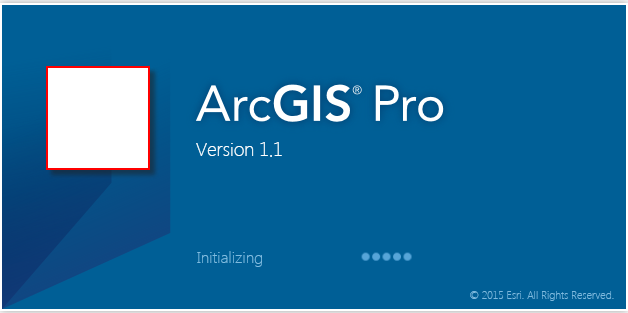

##Lab 6: Advanced Customizations 

#####In this lab you will learn how to
* Customize ArcGIS Pro splash screen
* Customize ArcGIS Pro using DAML
* Add a Customization Filter

*******
* [Step 1: Open the Lab6 Start Project](#step-1-open-the-lab6-start-project)
* [Step 2: Modify the Splash Screen](#step-2-modify-the-splash-screen)
* [Step 3: Add a DAML Filter](#step-3-add-a-daml-filter)
* [Step 4: Add a Customization Filter](#step-4-add-a-customization-filter)
* [Step 5: Implement a button to Toggle the Filter On or Off](#step-5-implement-a-button-to-toggle-the-filter-on-or-off)
* [Step 6: Compile and Execute the project](#step-6-compile-and-execute-the-project)

**Estimated completion time: 30 minutes**
****

####Step 1: Open the Lab6 Start Project
* Open Visual Studio and select Open Project. 
* Navigate to your `Labs\Day2\Lab 6\Start` folder and open the AdvancedCustomization.sln.

####Step 2: Modify the Splash Screen
 
* Examine the Images folder within the solution. You should see an image file `CustomSplash.png`.
* Make sure its content type is set to `Resource` (right-click, select properties).
* Open the ArcGISPro.Config.xml file also in the solution.
* Add a splash screen XML element. Set its assembly attribute to the full path of the AdvancedCustomization.dll. Set the image attribute to the relative pack:uri for the CustomSplash.png.

```xml

  <SplashScreen assembly="C:\ProSDKWorkshop\arcgis-pro-sdk-workshop-2day-master\Labs\Day2\Lab 6\Solution\AdvancedCustomization\bin\Debug\AdvancedCustomization.dll" image="Images/CustomSplash.png"/>

```

* Copy the ArcGISPro.Config.xml file to the bin folder of your ArcGIS Pro installation. Typically, this is `C:\Program Files\ArcGIS\Pro\bin`.
* Run ArcGIS Pro. You should see your Custom Splash. If you do NOT see your custom splash please check your path in the ArcGISPro.Config.xml. Please check that you copied the ArcGISPro.Config.xml to the bin folder.



####Step 3: Add a DAML Filter

* Examine the AdvancedCustomization solution. Notice that there is a daml file `CustomDamlFilter.daml`. You will be editing this file.
* Find the `<groups></groups>` element. Add the following DAML:

```xml
<group id="Advanced_DAML_Group1" caption="Filter group 1" appearsOnAddInTab="false">
          <!-- host controls within groups -->
          <!--Core Pro Commands-->
          <toolPalette refID="esri_mapping_newMapPalette" />
          <button refID="esri_core_saveProjectButton" />
          <button refID="esri_core_saveProjectAsButton" />
          <gallery refID="esri_mapping_bookmarksNavigateGallery" />
          <button refID="esri_mapping_mapContextMenu_ExportMap" />
        </group>
        <group id="Advanced_DAML_Group2" caption="Filter group 2" appearsOnAddInTab="false">
          <!-- host controls within groups -->
          <!--Core Pro Commands-->
          <toolPalette refID="esri_mapping_selectToolPalette" />
          <button refID="esri_mapping_clearSelectionButton" />
          <button refID="esri_geoprocessing_selectByAttributeButton" />
          <button refID="esri_geoprocessing_selectByLocationButton" />
        </group>
```

This may look familiar. It is the same DAML you used back on Day1, Lab 1.

* Define a tab to host these two groups. Add it to the `<tabs></tabs>` element:

```xml

<tab id="Advanced_DAML_Tab1" caption="Favorites" tabGroupID="Advanced_Daml_Filter_Tab">
          <group refID="Advanced_DAML_Group1" />
          <group refID="Advanced_DAML_Group2" />
        </tab>
		
```

* Modify the ArcGISPro.Config.xml and add a DAML element. Set its path attribute to the full path of your `CustomDamlFilter.daml` file.

```xml

  <DAML path="C:\ProSDKWorkshop\arcgis-pro-sdk-workshop-2day-master\Labs\Day2\Lab 6\Solution\AdvancedCustomization\CustomDamlFilter.daml"/>

```

* Copy the modified ArcGISPro.Config.xml file to the bin folder of your ArcGIS Pro installation.
* Run Pro. You should see your Favorites Tab on the Ribbon. If you do not see the Favorites Tab please check the path in your DAML element.

####Step 4: Add a Customization Filter

* Find the file `ExampleCustomizationFilter.cs`.
* Notice that the class `ExampleCustomizationFilter` derives from `Contract.CustomizationFilter`.
* In the constructor register the customization filter with the Framework

```c#
public ExampleCustomizationFilter() {
     FrameworkApplication.RegisterCustomizationFilter(this);
}
```

* Notice that a flag `public bool FilterOn` has been defined that will indicate if the filter is On or Off.
* In the overridden `` method add logic to disable any command clicks related to *editing* commands. To disable a command click you must return *false*.
* Hint: all editing command ids begin with `"esri_editing_"`

```c#
protected override bool OnCommandToExecute(string ID)
        {
            if (!FilterOn)
                return true;//don't filter
            //TODO: Add logic to return false if an editing command is being executed
			//Editing command ids all begin with "esri_editing_"
        }
```

####Step 5: Implement a button to Toggle the Filter On or Off

* Open the `ToggleFilterOnOff.cs` source file
* In the OnClick method instantiate the `private ExampleCustomizationFilter _filter` member if it is null. This will register the customization filter.

```c#

if (_filter == null) {
   //TODO - instantiate the command filter
}

```

* Toggle the customization filter On or Off with the button Click. Hint: Use the `_filter.FilterOn` property

**Bonus**

* Toggle the button caption and tooltip to reflect whether you are turning the filter On or Off with each button click
* Hint: Use the `this.Caption` and `this.Tooltip` properties.

####Step 6: Compile and Execute the project

* Open the `C:\ProSDKWorkshop\Data\Projects\FavoritesQueries\FavoriteQueries.aprx` project.
* Open the Add-in tab. Execute the "Turn Filter On" button
* Enable the editing tab. Click on `Create`. When the Filter is On the button should not do anything. Ditto for any other editing command you click.
* Turn the Filter Off. Now the Editor buttons should work.
