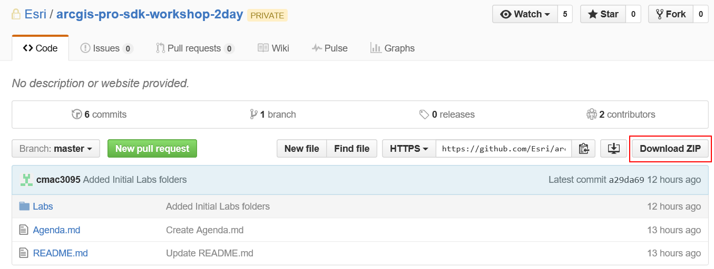

### Getting started with the ArcGIS Pro 1.2 SDK for .NET Workshop

* [Login Information](#login-information)
* [Workshop Agenda](Agenda.md)
* [Workshop Labs](#workshop-labs)
* [Sample Data](#sample-data)
* Quick Links
	* [ArcGIS Pro SDK for .NET Workshop](https://github.com/Esri/arcgis-pro-sdk-workshop-2day)
	* [API Reference Guide](http://pro.arcgis.com/en/pro-app/sdk/api-reference/webframedesktop.html)
	* [ArcGIS Pro SDK Wiki](https://github.com/Esri/arcgis-pro-sdk/wiki)
	* [ArcGIS Pro SDK for .NET Community Samples](https://github.com/Esri/arcgis-pro-sdk-community-samples)
	* [ArcGIS Pro SDK for .NET](http://pro.arcgis.com/en/pro-app/sdk/)


####Login Information

**Login to GitHub**   
* Browse to the [Esri Organization on GitHub](https://github.com/Esri/).
* If you are already signed in with your GitHub credentials please sign out at this time.
* Click the "Sign In" button on the top right.
* Use the following credentials to log in:  

```
username: sdkstudent 
password: sdk.student2015 
```

####Workshop Labs

* After [logging on to GitHub](#login-information), browse to the [ArcGIS Pro SDK for .NET Workshop repo](https://github.com/Esri/arcgis-pro-sdk-workshop-2day).  
* Download the labs using the "Download Zip" on the bottom right of the repo.  
  

* Extract the zip file to a folder C:\ProSDKWorkshop\arcgis-pro-sdk-workshop-2day-master folder.


```
C:\ProSDKWorkshop\arcgis-pro-sdk-workshop-2day-master\Labs  
```

####Sample Data

* At the beginning of the workshop an USB flash drive will be passed around to all participants.  This USB drive contains the \ProSDKWorkshop folder.
* Copy the \ProSDKWorkshop folder from the USB flash drive to the C:\ (root) on your laptop  

**Note:**  Most of the lab exercises expect the data to be in this path. If this path is not found, some of the instructions in the lab will not work.  

```
C:\ProSDKWorkshop 
```

####Deleting Add-ins.

From time to time you may want to delete the Add-ins from your machine either to unclutter your ArcGIS Pro UI or to eliminate conflicts between labs. To delete your Add-ins, navigate to your `C:\Users\<your username>\Documents\ArcGIS\AddIns\ArcGISPro` folder. Delete any of the guid-ed subfolders - each one contains a separate Add-in (recompiling any Add-in automatically copies it back to this folder).

If you prefer, you can use the following .cmd script and add it to your Desktop. Double-clicking it will delete all Add-ins:
(be sure to substitute the `XX - put your username here - XX` string with ~your~ username.)

```
echo off
rem http://stackoverflow.com/questions/1502913/how-to-delete-all-files-and-folders-in-a-folder-by-cmd-call
rem
echo Executing del /q "C:\Users\XX - put your username here - XX\Documents\ArcGIS\AddIns\ArcGISPro\*"
echo for /d %%x in ("C:\Users\XX - put your username here - XX\Documents\ArcGIS\AddIns\ArcGISPro\*") do @rd /s /q %%x

del /q "C:\Users\XX - put your username here - XX\Documents\ArcGIS\AddIns\ArcGISPro\*"
for /d %%x in ("C:\Users\XX - put your username here - XX\Documents\ArcGIS\AddIns\ArcGISPro\*") do @rd /s /q %%x
echo
echo Done
pause
```


